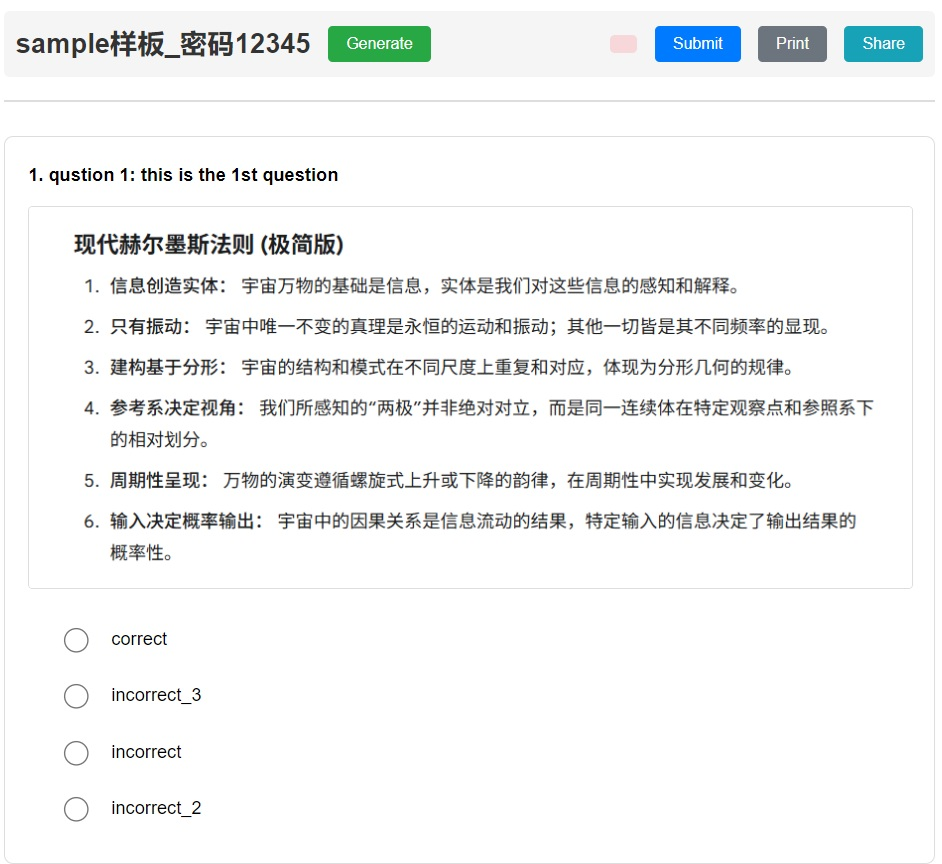

# Q&A Generator from ZIP

This project is a web-based Q&A quiz generator. It dynamically creates a quiz from a `.zip` file containing a `.csv` file for questions and answers, along with any associated image files.

## Features

- **Dynamic Quiz Generation**: Creates quizzes from a user-provided `.zip` file.
- **CSV-Based**: Questions, options, and correct answers are defined in a structured `.csv` file.
- **Image Support**: Embeds images referenced in the CSV file directly into the questions.
- **Password Protection**: Supports password-protected `.zip` archives using the `js7z` library.
- **Customizable Quizzes**: Allows users to set the number of questions and the passing percentage.
- **Interactive Feedback**: Provides immediate scoring and visual feedback on correct/incorrect answers.
- **Share Quiz**: Generates a standalone HTML file containing the current quiz. This file can be shared with others without requiring them to have the original ZIP file or any server setup. The shared quiz maintains all functionality including the ability to regenerate questions and submit answers.

## How to Use

1.  **Prepare your ZIP file**:
    *   Create a `.csv` file with your questions. The first row should be the question text, the second row should be the image file name (optional), and subsequent rows are the answer options.
    *   To mark an answer as correct, prefix it with a backtick (`).
    *   Place the `.csv` file and any image files into a single `.zip` archive. You can optionally password-protect it.

2.  **Run the application**:
    *   **Option 1: Use a Local Web Server (Recommended)**
        *   Due to browser security policies (CORS), you cannot run this application by simply opening `index.html`. You must serve it from a local web server.
        *   If you have Python installed, navigate to the project directory in your terminal and run:
            ```bash
            python -m http.server
            ```
        *   If you have Node.js installed, you can use the `serve` package:
            ```bash
            npx serve
            ```
        *   Alternatively, you can use a tool like the "Live Server" extension in VS Code.
    *   **Option 2: Use the Windows Batch Script (No Server Needed)**
        *   For Windows users without Python or Node.js, a convenience script is provided. Simply double-click `launch_dev_chrome.bat`.
        *   This will automatically find Chrome on your system and launch it in a special development mode that allows the application to run from local files.
        *   **Security Warning:** This mode disables certain browser security features. Only use the browser window it opens for this application. Do not browse other websites. Close the browser and the command window when you are finished.

3.  **Open the Quiz**:
    *   Open your web browser and navigate to `http://localhost:8000` (or the address provided by your server tool).
    *   Click the "Generate" button, select your `.zip` file, enter the password if required, and configure your quiz settings.

---

## Interface and Controls

The interface is designed for a simple, focused workflow:

-   **Quiz Title**: The name of the `.zip` file you select (without the file extension) is automatically used as the title for the quiz, displayed at the top left of the page.
-   **Generate Quiz Button**: This is the main button to start or refresh the quiz.
    -   **On first use**: Clicking this opens a file selection dialog. After you select a `.zip` file, a settings window appears where you can set the password, number of questions, and passing percentage.
    -   **On subsequent clicks**: If a quiz is already loaded, clicking this button will immediately re-generate a new set of questions from the same `.zip` file, using the same settings as before.
-   **Submit Answers Button**: After you have made your selections for each question, click this button to grade the quiz. Your score will be displayed at the top, and you will see visual feedback on your answers.
-   **Print Quiz Button**: Clicking this allows you to print the current quiz. This is useful for creating paper copies for offline use or for saving your results as a PDF.
-   **Share Quiz Button**: Clicking this generates a standalone HTML file containing the current quiz. This file can be shared with others without requiring them to have the original ZIP file or any server setup. The shared quiz maintains all functionality including the ability to regenerate questions and submit answers.

---

# Q&A Generator - ZIP问答生成器

本项目是一个基于Web的问答测验生成器。它可以从一个包含`.csv`文件（用于定义问题和答案）及相关图像文件的`.zip`压缩包中动态创建一个测验。

## 功能特性

- **动态测验生成**: 从用户提供的`.zip`文件创建测验。
- **基于CSV**: 问题、选项和正确答案在结构化的`.csv`文件中定义。
- **支持图像**: 将CSV文件中引用的图像直接嵌入到问题中。
- **密码保护**: 使用`js7z`库支持受密码保护的`.zip`压缩文件。
- **可定制的测验**: 允许用户设置问题数量和及格百分比。
- **交互式反馈**: 提供即时评分和关于正确/错误答案的视觉反馈。
- **分享测验**: 点击此按钮会生成一个包含当前测验的独立HTML文件。此文件可以分享给其他人，而无需他们拥有原始ZIP文件或任何服务器设置。分享的测验保留所有功能，包括重新生成问题和提交答案的能力。

## 如何使用

1.  **准备您的ZIP文件**:
    *   创建一个`.csv`文件来存放您的问题。第一行应为问题文本，第二行应为图像文件名（可选），后续行为答案选项。
    *   要将某个答案标记为正确答案，请在其前面加上一个反引号 (`) 字符。
    *   将`.csv`文件和所有相关的图像文件放入一个`.zip`压缩包中。您可以选择使用密码保护它。

2.  **运行应用程序**:
    *   **方法一：使用本地Web服务器（推荐）**
        *   由于浏览器的安全策略（CORS），您不能通过简单地双击打开`index.html`来运行此应用。您必须通过本地Web服务器来运行它。
        *   如果您安装了Python，请在终端中进入项目目录并运行：
            ```bash
            python -m http.server
            ```
        *   如果您安装了Node.js，您可以使用`serve`包：
            ```bash
            npx serve
            ```
        *   或者，您也可以使用像VS Code中的"Live Server"之类的工具。
    *   **方法二：使用Windows批处理脚本（无需服务器）**
        *   对于没有安装Python或Node.js的Windows用户，我们提供了一个便捷的脚本。只需双击 `launch_dev_chrome.bat` 文件。
        *   该脚本会自动查找您系统上安装的Chrome浏览器，并以一种特殊的开发模式启动它，从而允许应用程序从本地文件运行。
        *   **安全警告：** 此模式会禁用部分浏览器安全功能。请仅将打开的浏览器窗口用于此应用程序，不要用它浏览其他网站。完成使用后，请关闭浏览器和命令行窗口。

3.  **开始测验**:
    *   打开您的网络浏览器并访问`http://localhost:8000`（或您的服务器工具提供的地址）。
    *   点击"Generate"按钮，选择您的`.zip`文件，如果需要，请输入密码，并配置您的测验设置。


---

## 界面与控件说明

界面设计简洁，操作流程如下：

-   **测验标题**: 您所选择的`.zip`文件名（不含文件扩展名）会自动用作测验的标题，并显示在页面左上方。
-   **生成测验按钮**: 这是用于开始或刷新测验的主要按钮。
    -   **首次使用时**: 点击此按钮会打开文件选择对话框。在您选择`.zip`文件后，会弹出一个设置窗口，您可以在其中设置密码、问题数量和及格分数线。
    -   **再次点击时**: 如果已经加载了测验，再次点击此按钮将立即使用与之前相同的设置，从同一个`.zip`文件中重新生成一套新的问题。
-   **提交答案按钮**: 在您完成所有问题的选择后，点击此按钮为测验评分。您的分数将显示在顶部，同时您会看到关于答案的视觉反馈。
-   **打印测验按钮**: 点击此按钮可以打印当前测验。这个功能很实用，可以用于创建纸质版测验以供线下使用，或将您的作答结果保存为PDF文件。
-   **分享测验按钮**: 点击此按钮会生成一个包含当前测验的独立HTML文件。此文件可以分享给其他人，而无需他们拥有原始ZIP文件或任何服务器设置。分享的测验保留所有功能，包括重新生成问题和提交答案的能力。

